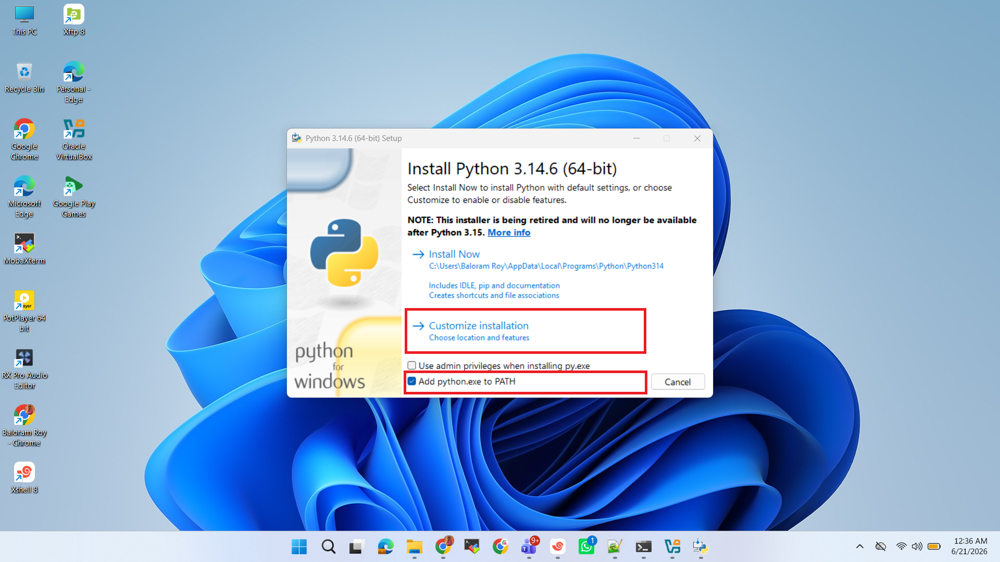
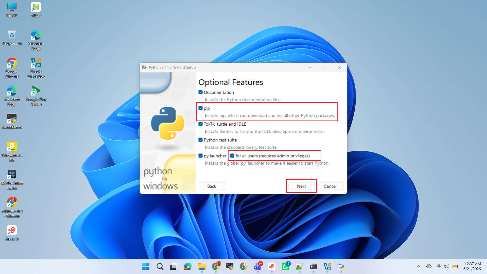
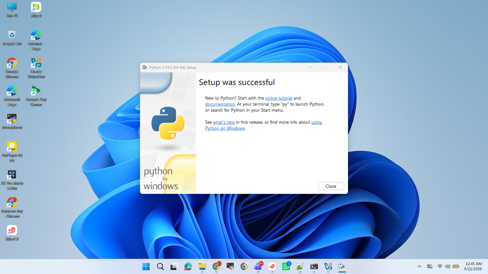

# SOP: Install Python on Windows

## Purpose
This Standard Operating Procedure (SOP) provides a step-by-step guide for installing Python on a Windows operating system. The procedure ensures a consistent, reliable installation with the necessary environment variables configured for immediate use.

---

## Scope
This SOP applies to all Windows 10 and Windows 11 workstations within the organization where Python 3.x is required for development, scripting, or automation tasks.

---

## Prerequisites

- **Administrator Privileges:** \
    You must have local administrator rights on the target machine to install software and modify system environment variables.

- **Internet Connection:** \
    Required to download the Python installer from the official website.

- **System Architecture Knowledge:** \
    Know whether your Windows installation is 32-bit (x86) or 64-bit (x64). To check, go to **Settings** > **System** > **About** and look for **"System type"**


---

## Download Python

1. Open your web browser.

2. Go to the official Python website:

   **[Python Downloads for Windows](https://www.python.org/downloads/windows/?utm_source=chatgpt.com)**

3. Download the latest stable **64-bit** Windows installer (`Windows installer (64-bit)`), unless you specifically need a 32-bit version.

> Avoid downloading Python from unofficial websites.

---

## Run the Installer

1. Navigate to your Downloads folder.
2. Double-click the downloaded `.exe` file.

You should see the Python Setup window.


---

## Enable "Add Python to PATH"

**This is one of the most important steps.**

At the bottom of the installer window:


☑ **Check the box:** `Add python.exe to PATH`

If you skip this step, you'll need to **configure PATH** manually later.

---

## Select Installation Type

Click **Install Now** for a standard installation with default settings.



For advanced users who want to change the installation directory, click **Customize installation**

---

## Customize Installation (If selected)



- Ensure **pip (Python package installer)** is checked. This is essential for installing **third-party libraries**. 

- IDLE (the built-in IDE) and other features can be selected as needed. 

- Install for **all users**: IT Changes the installation directory to **C:\Program Files\Python3x**

- Click **Next**.


## Start Installation

From this Page, Click:

```
Install Now
```


- This installs Python with recommended defaults.

- Wait for the installation to complete.

---

## Finish Installation



When installation completes, you should see:

```
Setup was successful
```

Click:

```
Close
```

---

## Verify Python Installation

- Open **Command Prompt** (`cmd`) or **Powershell** and run:

  ```cmd
  python --version
  ```

- Expected output (example):

  ```text
  Python 3.14.0
  ```

- Also check:

  ```cmd
  python -V
  ```

---

## Verify pip Installation

- Run:

  ```cmd
  pip --version
  ```

- Expected output:

  ```text
  pip 25.x from C:\Program Files\Python314\Lib\site-packages\pip (python 3.14)
  ```

  **Note:** If this works, `pip` is installed correctly.

---

## Upgrade pip

- Run:

  ```cmd
  python -m pip install --upgrade pip
  ```

  **Note:** This ensures you have the latest package manager.

---

## Check PATH Configuration

- Run:

  ```cmd
  where python
  ```

- You should see output similar to:

  ```text
  # C:\Program Files\Python314\python.exe 
  # C:\Users\<YourUser>\AppData\Local\Programs\Python\Python314\python.exe
  ```

- Also verify pip:

  ```cmd
  where pip
  ```

---


## Test Python by Run Hellow World

- Run this in `cmd`:

  ```cmd
  python
  ```

- You should enter the **Python interactive shell**:

  ```python
  Python 3.x.x
  >>>
  ```

- Test it:

  ```python
  print("Hello, World!")
  ```

- Output:

  ```text
  Hello, World!
  ```

- Exit with:

  ```python
  exit()
  ```

  or press:

  ```
  Ctrl + Z
  Enter
  ```

---

## Create a Test Project to Check

- Create a folder:

  ```text
  D:\Projects\python-test
  ```

- Inside it, create `hello.py`:

  ```python
  print("Python is installed successfully!")
  ```

- Open Command Prompt in that folder and run:

  ```cmd
  python hello.py
  ```

- Expected output:

  ```text
  Python is installed successfully!
  ```

---

## Quick Verification Checklist

* ✅ Python installed successfully
* ✅ `python --version` works
* ✅ `pip --version` works
* ✅ `where python` shows the installed location
* ✅ A simple `hello.py` script runs correctly
* ✅ (Optional) Virtual environment can be created and activated


