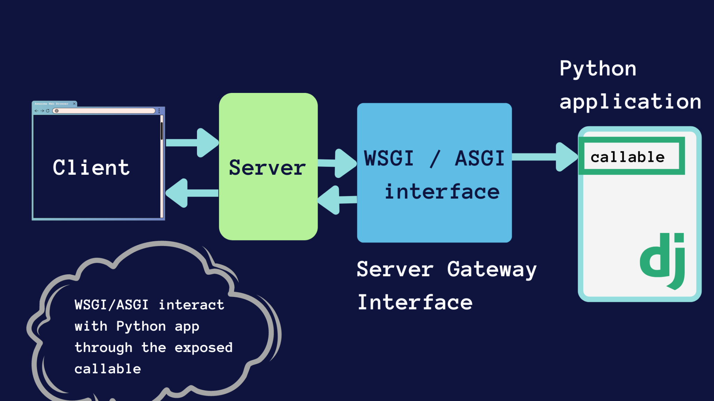

# Understanding Django Project and App Directories

When you create a Django project and an app, Django generates several files and folders automatically. Each has a specific purpose.

## 1. Django Project Structure

When you run:

```bash
django-admin startproject my-project
```

Django creates:

```text
web-project/
├── manage.py
└── my-project/
    ├── __init__.py
    ├── asgi.py
    ├── settings.py
    ├── urls.py
    └── wsgi.py
```

---

### `web-project/` (Outer Folder)

This is the **root directory** of your Django project. It contains the `manage.py` script and the inner project package.

Example:

```text
web-project/
├── manage.py
└── my-project/
```

You typically run Django management commands from this directory.

---

### `manage.py`

This is a command-line utility used to interact with your Django project.

**Purpose:**

* Run the development server
* Apply database migrations
* Create apps
* Create administrator accounts
* Open the Django shell
* Execute many other management tasks

**Common commands:**

```bash
python manage.py runserver
python manage.py migrate
python manage.py createsuperuser
python manage.py startapp blog
python manage.py check
```

Think of `manage.py` as the **main control script** for your project.

---

### `my-project/` (Inner Folder)

This inner folder is a **Python package** that contains your project's configuration.

It stores settings and entry points used by Django.

---

### `__init__.py`

Marks the directory as a Python package.

**Purpose:**

* Allows Python to import modules from this directory.
* Usually empty unless custom initialization is needed.

Example:

```python
# __init__.py
```

---

### `settings.py`

This is one of the most important files in Django.

It contains the project's configuration.

**Examples of settings stored here:**

* Installed applications
* Database configuration
* Secret key
* Debug mode
* Time zone
* Language
* Static file settings
* Middleware
* Templates

Example:

```python
INSTALLED_APPS = [
    "django.contrib.admin",
    "django.contrib.auth",
    "myapp",
]
```

Think of `settings.py` as the **central configuration file** for the project.

---

### `urls.py`

Defines URL routing for the project.

It maps incoming URLs to views.

Example:

```python
from django.contrib import admin
from django.urls import path

urlpatterns = [
    path("admin/", admin.site.urls),
]
```

If a user visits:

```
http://127.0.0.1:8000/admin/
```

Django routes the request to the admin interface.

Think of `urls.py` as the **traffic controller**.

---

### `wsgi.py`

**Defination:**\
A WSGI (**Web Server Gateway Interface**) server is a standardized piece of software that acts as a **bridge** between a **traditional web** server (like Nginx or Apache) and a **Python web application** or **framework** (like Django or Flask).

- Provides an entry point for **WSGI-compatible web servers**.

- Used in many production deployments with servers such as:

  * Gunicorn
  * uWSGI
  * Apache (mod_wsgi)

  >Developers usually do not modify this file.

---

### `asgi.py`

**Defination:**\
An ASGI (**Asynchronous Server Gateway Interface**) server acts as the bridge between Python web applications and the web. It is the **modern evolution of WSGI**, explicitly designed to handle **asynchronous** code, HTTP/2, and long-lived connections like WebSockets or SSE (Server-Sent Events).

- Provides an entry point for **ASGI-compatible servers**.

- Used for:

  * WebSockets
  * Asynchronous applications
  * Real-time communication
  * Modern async features

- Common ASGI servers include:

  * Uvicorn
  * Daphne
  * Hypercorn

  >For many basic projects, this file requires no changes.


### wsgi vs asgi



---

## 2. Django App Structure

When you run:

```bash
python manage.py startapp myapp
```

Django creates:

```text
myapp/
├── admin.py
├── apps.py
├── migrations/
├── models.py
├── tests.py
├── views.py
└── __init__.py
```

A **Django app** is a self-contained component that implements a specific feature. One project can contain multiple apps.

For example:

* `accounts` → user management
* `blog` → blog functionality
* `shop` → e-commerce features
* `payments` → payment processing

---

### `admin.py`

Used to register models with the Django admin interface.

Example:

```python
from django.contrib import admin
from .models import Book

admin.site.register(Book)
```

After registration, you can manage `Book` objects through `/admin/`.

---

### `apps.py`

Contains the app's configuration.

Example:

```python
from django.apps import AppConfig

class MyappConfig(AppConfig):
    default_auto_field = "django.db.models.BigAutoField"
    name = "myapp"
```

Django uses this configuration when loading the app.

---

### `migrations/`

Stores migration files that describe database schema changes.

Example:

```text
migrations/
├── __init__.py
├── 0001_initial.py
├── 0002_add_author.py
```

When you modify models, you typically run:

```bash
python manage.py makemigrations
python manage.py migrate
```

These files help Django update the database safely.

---

### `models.py`

Defines the database schema using Python classes.

Example:

```python
from django.db import models

class Book(models.Model):
    title = models.CharField(max_length=200)
    author = models.CharField(max_length=100)
```

Django uses these model definitions to create and manage database tables.

Think of `models.py` as the place where you define **what data your application stores**.

---

### `tests.py`

Contains automated tests for the app.

Example:

```python
from django.test import TestCase

class BookTest(TestCase):
    pass
```

Running:

```bash
python manage.py test
```

executes these tests to verify your application's behavior.

---

### `views.py`

Contains view functions or classes that process requests and generate responses.

Example:

```python
from django.http import HttpResponse

def home(request):
    return HttpResponse("Hello, Django!")
```

When a matching URL is requested, Django calls the view and returns its response to the client.

Think of `views.py` as the place where you implement **application logic and responses**.

---

### `__init__.py`

Marks the app directory as a Python package and is usually left empty.

---

## Relationship Between Project and App

```text
                Django Project (my-project)
                         │
         ┌───────────────┴────────────────┐
         │                                │
    Project Settings                 Project URLs
      settings.py                     urls.py
         │
         │
    INSTALLED_APPS
         │
         ▼
    ┌─────────────┐
    │    myapp    │
    ├─────────────┤
    │ models.py   │ → Defines database tables
    │ views.py    │ → Handles requests
    │ admin.py    │ → Configures admin interface
    │ tests.py    │ → Holds automated tests
    │ apps.py     │ → App configuration
    │ migrations/ │ → Tracks database schema changes
    └─────────────┘
```

---

## Project vs. App at a Glance

| Component                 | Purpose                                                                                                                      |
| ------------------------- | ---------------------------------------------------------------------------------------------------------------------------- |
| **Project (`my-project`)** | The overall Django website or application. It holds global configuration, URL routing, and settings.                         |
| **App (`myapp`)**         | A modular component that provides a specific piece of functionality, such as a blog, authentication system, or online store. |
| `manage.py`               | Command-line tool for managing the project.                                                                                  |
| `settings.py`             | Central configuration for the project.                                                                                       |
| `urls.py`                 | Maps URLs to views.                                                                                                          |
| `models.py`               | Defines database models and schema.                                                                                          |
| `views.py`                | Processes requests and returns responses.                                                                                    |
| `admin.py`                | Registers models for the Django admin interface.                                                                             |
| `migrations/`             | Stores database migration files.                                                                                             |
| `tests.py`                | Contains automated tests.                                                                                                    |
| `apps.py`                 | Defines app-specific configuration.                                                                                          |
---

## Real-world analogy

* **Project** = A shopping mall.
* **Apps** = Individual stores inside the mall (bookstore, pharmacy, food court, etc.).
* **`settings.py`** = The mall's overall operating rules.
* **`urls.py`** = The mall's directory that tells visitors where to go.
* **`models.py`** = The inventory records for each store.
* **`views.py`** = The staff who interact with customers and provide services.
* **`admin.py`** = The management office used to administer store data.
* **`migrations/`** = The renovation plans that update the building structure over time.

---