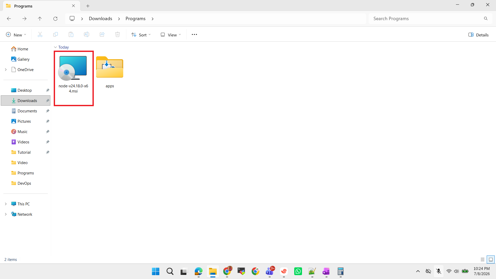
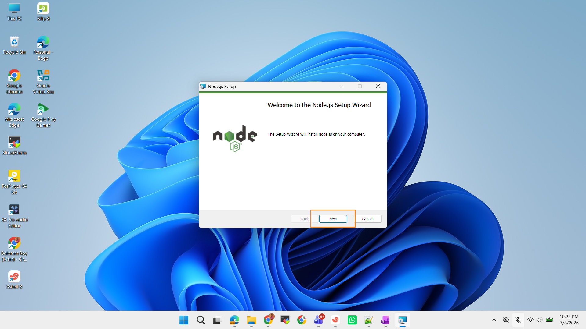
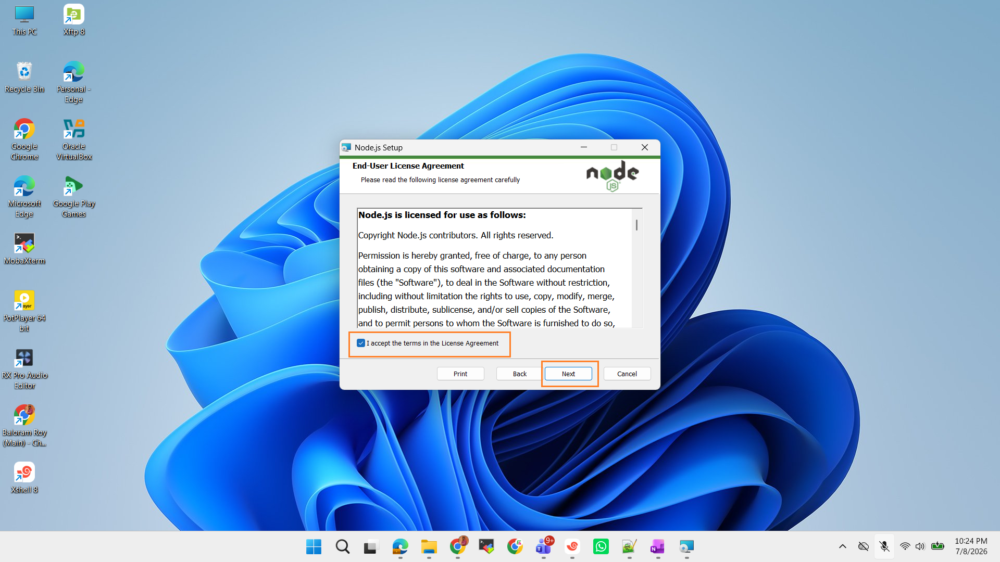
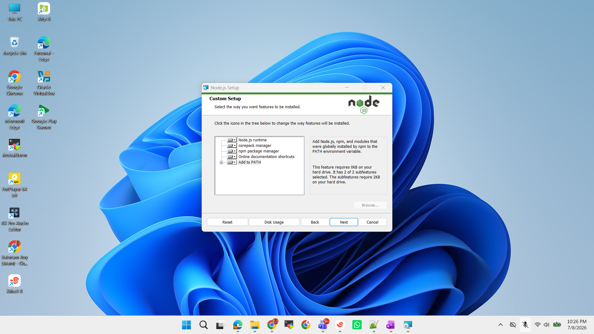
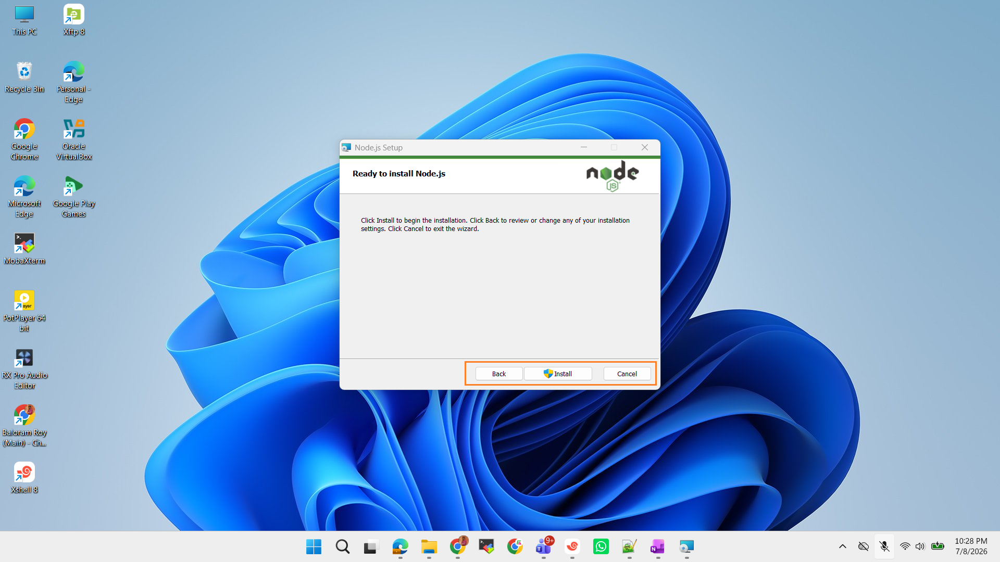

# Node.js Installation Standard Operating Procedure (SOP)

## Document Information
- **Version:** 1.0
- **Date:** July 8, 2026
- **Author:** Baloram Roy

---

## 1. Purpose
This Standard Operating Procedure (SOP) provides step-by-step instructions for installing Node.js on a **Windows operating system.**

---

## 2. Scope
This SOP applies to all developers, system administrators, and IT personnel responsible for setting up Node.js development environments on Windows machines.

---

## 3. Prerequisites
Before beginning the installation, ensure the following:
- **Administrator privileges** on the target machine
- Stable internet connection
- Minimum 500 MB of free disk space
- Windows 7/8/10/11 or Windows Server 2012/2016/2019/2022

---

## 4. Installation Procedure

### 4.1 Download Node.js Installer
1. Navigate to the official Node.js website: [https://nodejs.org/](https://nodejs.org/)
2. Download the **LTS (Long-Term Support)** version for Windows
3. Save the installer file (e.g., `node-vXX.X.X-x64.msi`) to a known location

> Locate the `Node.js Setup` file on the desktop or downloads folder.

---

### 4.2 Launch the Installer
1. **Double-click** the `Node.js Setup` executable file
2. If a User Account Control (UAC) prompt appears, click **Yes** to allow the installer to make changes
   


---

### 4.3 Welcome Screen
1. The **Node.js Setup Wizard** welcome screen will appear
2. Click **Next** to proceed


---

### 4.4 End-User License Agreement
1. Read the End-User License Agreement (EULA) carefully
2. **Check** the box: `I accept the terms in the License Agreement`
3. Click **Next** to continue



**Note:** \
If you do not accept the terms, installation will be cancelled.

---

### 4.5 Destination Folder
1. The default installation path is: `C:\Program Files\nodejs\`
2. To change the location:
   - Click **Change...**
   - Browse to your preferred directory
   - Click **OK**
3. Click **Next** to continue


**Recommendation:** \
Use the default installation path unless custom configuration is required.

---

### 4.6 Custom Setup
The installer provides the following features:

| Feature | Description |
|---------|-------------|
| Node.js runtime | Core execution engine |
| npm package manager | Package management tool |
| corepack manager | Package manager wrapper |
| Online documentation shortcuts | Quick access to documentation |
| Add to PATH | Adds Node.js and npm to system PATH variable |

**Configuration Steps:**

1. **Verify that all features are selected** (default selection includes all features)
2. **Crucial:** Ensure `Add to PATH` is checked
   - This allows you to run Node.js and npm commands from any command prompt
3. Click **Next** to continue



**Note:** The `Add to PATH` feature requires 2KB and includes 2 subfeatures.

---

### 4.7 Tools for Native Modules (Optional)

1. **Option 1 - Recommended for Developers:**
   - Check `Automatically install the necessary tools`
   - This installs Python and Visual Studio Build Tools via Chocolatey
   - A separate installation window will appear after Node.js installation
   
2. **Option 2 - Manual Installation:**
   - Leave the checkbox unchecked
   - Follow instructions at: [https://github.com/nodejs/node-gyp-for-windows](https://github.com/nodejs/node-gyp-for-windows)

**Leave the checkbox unchecked and click Next to proceed**


**Note:** \
This step is optional but recommended if you plan to install npm packages that require compilation from C/C++ source code.

---

### 4.8 Ready to Install
1. Review all installation settings:
   - Installation path
   - Selected features
   - Additional tools selection
2. Click **Install** to begin the installation
3. To make changes, click **Back**
4. To cancel, click **Cancel**



---

### 4.9 Installation Progress
1. The installer will display installation progress
2. Wait for the installation to complete
3. **Do not** interrupt the installation process

**Status indications:**
- Status bar shows current progress
- No user interaction required during this phase


---

### 4.10 Completion
1. The "Completed the Node.js Setup Wizard" screen appears
2. Verify that `Node.js has been successfully installed` message is displayed
3. Click **Finish** to exit the setup wizard


---

## 5. Post-Installation Verification

### 5.1 Verify Node.js Installation
1. Open **Command Prompt** (cmd) or **PowerShell**
2. Type the following command:
   ```cmd
   node --version
   ```
   **Expected Output:** Version number (e.g., `v20.x.x`)

3. Type the following command:
   ```cmd
   npm --version
   ```
   **Expected Output:** Version number (e.g., `10.x.x`)

### 5.2 Verify PATH Configuration
1. In Command Prompt or PowerShell, type:
   ```cmd
   where node
   ```
   **Expected Output:** Path to Node.js executable (e.g., `C:\Program Files\nodejs\node.exe`)

2. Type:
   ```cmd
   where npm
   ```
   **Expected Output:** Path to npm executable (e.g., `C:\Program Files\nodejs\npm.cmd`)

---

## 6. Troubleshooting

**Common Issues and Solutions**

| Issue | Solution |
|-------|----------|
| `'node' is not recognized` | Node.js not added to PATH. Reinstall with "Add to PATH" option selected |
| Permission errors | Run installer as Administrator |
| Installation stuck | Check internet connection, disable antivirus temporarily |
| npm not working | Reinstall or run `npm update -g npm` after installation |

---

## 7. Post-Installation Tasks (Optional)

### 7.1 Update npm
```cmd
npm install -g npm@latest
```

### 7.2 Install Development Tools
If selected during installation, the tools for native modules will automatically install via Chocolatey after Node.js installation completes.

### 7.3 Test Installation with Sample Application
```cmd
mkdir test-app
cd test-app
npm init -y
npm install express
```

---


**END OF DOCUMENT**